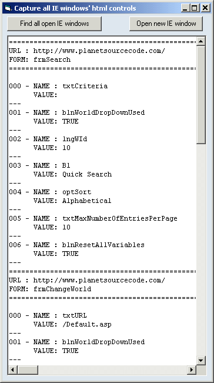



## Internet Explorer Forms

### Description

Read and edit the names and values of all the html controls (textboxes, buttons, lists, checkboxes) in all currently open Internet Explorer windows. Hope you find it useful.
 
### More Info
 

             |
---                |---
**Submitted On**   |2004-06-03 11:30:38
**By**             |[Edwin Perez](https://github.com/Planet-Source-Code/PSCIndex/blob/master/ByAuthor/edwin-perez.md)
**Level**          |Intermediate
**User Rating**    |5.0 (15 globes from 3 users)
**Compatibility**  |VB 5\.0, VB 6\.0
**Category**       |[Internet/ HTML](https://github.com/Planet-Source-Code/PSCIndex/blob/master/ByCategory/internet-html__1-34.md)
**World**          |[Visual Basic](https://github.com/Planet-Source-Code/PSCIndex/blob/master/ByWorld/visual-basic.md)
**Archive File**   |[Internet\_E175333632004\.zip](https://github.com/Planet-Source-Code/edwin-perez-internet-explorer-forms__1-54160/archive/master.zip)

